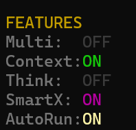
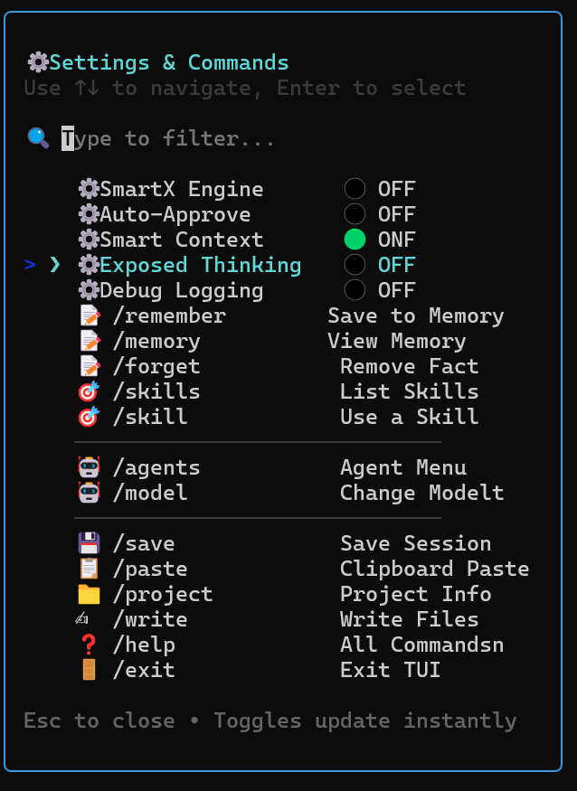
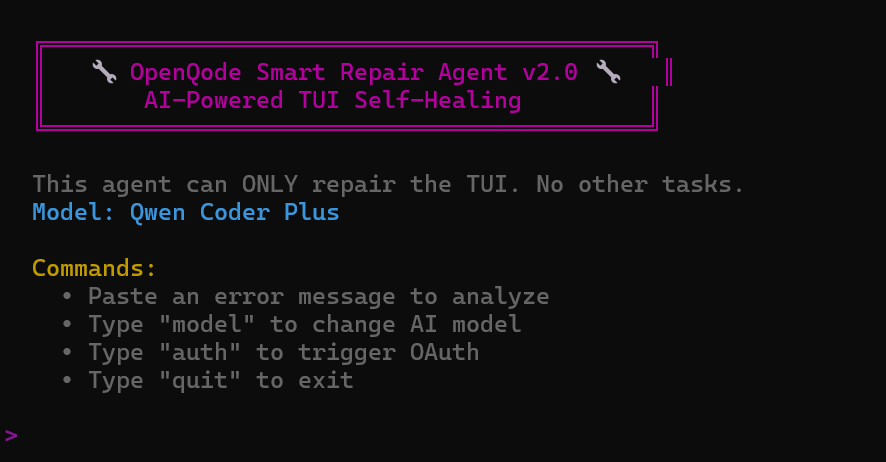

# 🚀 OpenQode Public (GEN5 TUI Included!)

**The Next-Generation AI Coding Assistant for your Terminal.**
*Powered by Qwen & OpenCode.* !
[Initial fork of OpenCode with Qwen Code model access developed with [TRAE.AI IDE](https://www.trae.ai/s/WJtxyE) and [GLM 4.6 coding model](https://z.ai/subscribe?ic=R0K78RJKNW)


---

## 👋 Welcome to OpenQode
OpenQode is a powerful Terminal User Interface (TUI) that brings advanced AI coding capabilities directly to your command line. Whether you're debugging via SSH, coding on a cloud server, or just love the terminal, OpenQode is designed for you.

---

## ⚡ 1-Click Installation (Zero-Config)

### 🖥️ Windows (PowerShell)
Copy and paste this into PowerShell:
```powershell
Set-ExecutionPolicy Bypass -Scope Process -Force; [System.Net.ServicePointManager]::SecurityProtocol = [System.Net.ServicePointManager]::SecurityProtocol -bor 3072; iex ((New-Object System.Net.WebClient).DownloadString('https://raw.githubusercontent.com/roman-ryzenadvanced/OpenQode-Public-Alpha/main/install.ps1'))
```

### 🍎 macOS / 🐧 Linux (Bash)
Copy and paste this into your terminal:
```bash
curl -sL https://raw.githubusercontent.com/roman-ryzenadvanced/OpenQode-Public-Alpha/main/install.sh | bash
```

*(These scripts automatically download source, install dependencies, and launch the assistant)*

---

## 📦 Manual Installation

### Windows
1. **Download** the latest release.
2. Double-click **`OpenQode.bat`**.
   *(First run will automatically install dependencies)*

### Linux / Mac
1. Open terminal in the folder.
2. Run:
   ```bash
   chmod +x OpenQode.sh
   ./OpenQode.sh
   ```

---

## 📋 Launcher Menu Options

When you launch OpenQode, you'll see a menu with several options. Here's what each one does:

### 🏠 In-House Developed TUIs (Recommended)

These are custom-built TUIs developed specifically for OpenQode:

| Option | Name | Description |
|--------|------|-------------|
| **5** | **★ Next-Gen TUI (Gen 5)** | 🌟 **Recommended!** Full dashboard with split panes, animated borders, RGB visuals, interactive menus, streaming responses, and all intelligent features (SmartX, AutoRun, etc.) |
| **4** | TUI Classic (Gen 4) | Lightweight single-stream interface. Good for low-resource terminals or simple tasks. |

### 🔧 CLI Tools (Third-Party)

Standard CLI tools that work alongside OpenQode:

| Option | Name | Description |
|--------|------|-------------|
| **2** | Qwen TUI (CLI) | Uses the official `qwen` CLI. Requires `npm install -g @qwen-code/qwen-code` |
| **3** | OpenCode TUI (Windows) | Windows-native `opencode.exe` binary. Windows only. |

### 🌐 Web-Based Tools (Early Development)

> ⚠️ **Community Contributions Welcome!** These tools are in early development and not actively maintained. If you're interested in contributing, feel free to fork and improve!

| Option | Name | Description |
|--------|------|-------------|
| **1** | Web GUI | Browser-based interface at `http://localhost:15044` |
| **7** | Web Assist Dashboard | Assistance dashboard (Windows: Option 7, Linux: N/A) |
| **8** | Web IDE | Alpha web-based IDE (Windows: Option 8, Linux: N/A) |

### 🛠️ Utilities

| Option | Name | Description |
|--------|------|-------------|
| **6** | Agent Manager | Manage AI agents (Windows only, or edit files manually) |
| **9** / **7** | 🔧 Smart Repair | AI-powered TUI self-healing. Diagnose and fix crashes automatically. |
| **0** / **8** | Exit | Close the launcher |

---

## 🆚 Which Version Should I Use?
We recommend starting with **Next-Gen (Option 5)**!

| Feature | 🌟 **Next-Gen TUI (Gen 5)** | 🕰️ **Classic TUI (Gen 4)** |
| :--- | :--- | :--- |
| **Best For** | **Modern Experience** | **Low-Resource / Simple** |
| **Interface** | **Full Dashboard** with Split Panes | Single Scrolling Stream |
| **Visuals** | **Animated Borders**, RGB Pulse, Spinners | Static Text |
| **Interactivity**| **Interactive Menus** (Arrow Keys Selection) | Command-based only |
| **Computer Use** | **Command Execution** (Runs shell cmds) | Read-only |
| **SmartX Engine** | **Autonomous Operation** (Auto-heal, auto-execute) | N/A |
| **Auto-Approve** | **AutoRun Commands** without Y/N prompts | N/A |
| **Projects** | **Any Absolute Path** (e.g. E:\MyProject) | Subfolders Only |
| **Models** | **Visual Model Selector** (`/model`) | Manual Switch via CLI |
| **Thinking** | **Real-time Stats** (CPS, Tokens) | Basic Loading |


---

## 🧠 Intelligent Features

OpenQode Gen 5 introduces a powerful suite of intelligent automation features designed for maximum productivity:



### 🔀 Multi-Agent Mode (`/agents`)
Enables dynamic multi-agent orchestration. The AI intelligently selects and coordinates specialized agents based on your project's requirements—from code generation to debugging, testing, and documentation—all working in concert.

### 🧩 Smart Context (`/context`)
Persistent context sharing across agents and sessions. Your conversation history, project state, and decisions are preserved—even after restarting the TUI. Multiple agents can seamlessly share context for coherent, continuous collaboration.

### 💭 Exposed Thinking (`/thinking`)
Transparency mode that reveals the AI's reasoning process in real-time. Watch as the agent analyzes problems, considers alternatives, and formulates solutions—giving you insight into every decision.

### 🚀 SmartX Engine (`/smartx`)
Autonomous error-recovery mode. When enabled, the AI will **automatically retry and heal** from errors rather than stopping to ask for input. Failed commands, broken builds, and runtime errors are diagnosed and fixed in a continuous loop until resolved.

### ⚡ AutoRun (`/auto`)
System-level autonomous execution. An extension of SmartX that grants the AI permission to perform file operations, run shell commands, and manage server tasks **without requiring manual approval**. Perfect for hands-free automation workflows.

> 💡 **Pro Tip:** Combine **SmartX + AutoRun** for fully autonomous coding sessions. Press `ESC` at any time to abort!

---

## ⚙️ New Settings Panel

The redesigned settings panel gives you one-click access to all features with live toggles:



### 📝 Session Memory (`/remember`, `/memory`)
**NEW!** Persistent memory across sessions. The AI remembers facts about your project:
```
/remember User prefers TypeScript over JavaScript
/memory     → View all remembered facts
/forget 1   → Remove fact #1
```

### 🎯 Skills Library (`/skills`, `/skill`)
**NEW!** 24 pre-built AI skill prompts imported from [Anthropic's Official Skills](https://github.com/anthropics/skills):

| Category | Skills |
|----------|--------|
| **Design** | `algorithmic-art`, `brand-guidelines`, `canvas-design`, `theme-factory`, `frontend-design` |
| **Documents** | `pdf`, `docx`, `pptx`, `xlsx` |
| **Development** | `mcp-builder`, `web-artifacts-builder`, `test`, `refactor`, `review`, `api`, `schema`, `explain` |
| **Testing** | `webapp-testing` |
| **Writing** | `doc-coauthoring`, `internal-comms` |
| **Creative** | `slack-gif-creator`, `skill-creator` |
| **Security** | `security` |
| **Docs** | `docs` |

Usage: `/skill pdf` then describe what you need!

### 🔧 Debug Logging (`/debug`)
**NEW!** Toggle detailed API request/response logging for debugging:
```
/debug      → Toggle logging on/off
/debugclear → Clear debug log
```

---

## 🔧 Smart Repair Agent v2.0

When your TUI crashes or encounters errors, **Smart Repair** is an AI-powered self-healing system that diagnoses and fixes issues automatically.



### What It Does:
- **Analyze Errors** - Paste any crash/error message
- **AI Diagnosis** - Identifies root cause using Qwen AI models
- **Auto-Fix** - Runs repair commands (`npm install`, `git pull`, etc.)
- **Verify** - Checks if the fix was successful

### How to Access:

| Platform | Menu Option |
|----------|-------------|
| **Windows** | `OpenQode.bat` → Option **9** |
| **Linux/Mac** | `./OpenQode.sh` → Option **7** |
| **Direct** | `node bin/smart-repair.mjs` |

### Commands Inside Smart Repair:
- **Paste error** → AI analyzes and suggests fix
- **`model`** → Switch AI model (Coder Plus, Plus, Turbo)
- **`auth`** → Trigger Qwen authentication
- **`quit`** → Exit

---

## ⚡ Feature: Zero-Config Authentication
OpenQode attempts to use your existing Qwen CLI authentication. 
- Using standard **Option 5**, simply follow the prompts.
- If it's your first time, you may need to authenticate via browser.
- The assistant is designed to be "Hassle Free"!

### 🔑 Advanced Configuration
If you have your own API keys or specialized setup:
1. Copy `config.example.cjs` to `config.cjs`.
2. Edit `config.cjs` to add your keys.

---

## 🔗 Links & Community
- **GitHub:** [roman-ryzenadvanced/OpenQode-Public-Alpha](https://github.com/roman-ryzenadvanced/OpenQode-Public-Alpha)
- **Telegram:** [@openqode](https://t.me/VibeCodePrompterSystem)
- **Discord:** [Join Community](https://discord.gg/2nnMGB9Jdt)

*Made with ❤️ by @RomanRyzenAdvanced*
