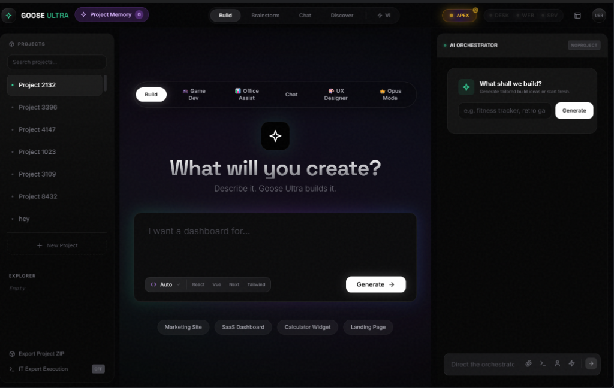
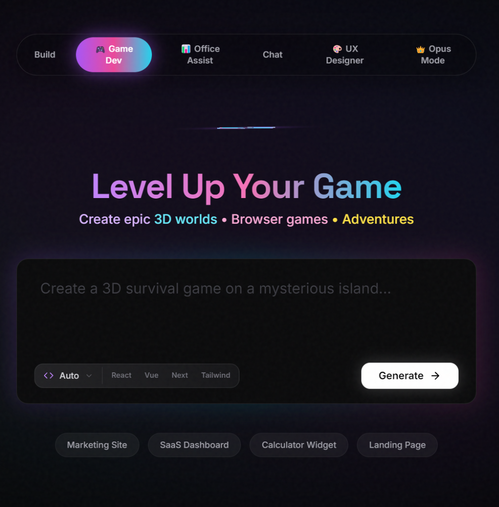

# 🚀 OpenQode v1.01 - Goose Ultra Edition

**The Next-Generation AI-Powered IDE for Modern Developers.**  
*Powered by Qwen AI • Built with Electron • Full-Stack Development Made Easy*



---

## 🚀 Full-Auto Installation (One Command)

Run this in your terminal to clone, install dependencies, and build everything automatically:

**Windows (PowerShell):**
```powershell
git clone https://github.com/roman-ryzenadvanced/OpenQode-Public-Alpha.git; cd OpenQode-Public-Alpha; npm install --legacy-peer-deps; cd bin/goose-ultra-final; npm install --legacy-peer-deps; npm run build; cd ../..; Write-Host "✅ OpenQode is ready. Run OpenQode.bat to start." -ForegroundColor Green
```

**macOS / Linux (Bash):**
```bash
git clone https://github.com/roman-ryzenadvanced/OpenQode-Public-Alpha.git; cd OpenQode-Public-Alpha; npm install --legacy-peer-deps; cd bin/goose-ultra-final; npm install --legacy-peer-deps; npm run build; cd ../..; echo -e "\033[0;32m✅ OpenQode is ready. Run ./OpenQode.sh to start.\033[0m"
```

---

## 🎯 What is OpenQode?

OpenQode is a comprehensive AI coding assistant that brings the power of large language models directly to your development workflow. The flagship **Goose Ultra** application provides a beautiful, feature-rich IDE experience.

---

## ⚡ Quick Start (Manual)

### Windows
```batch
# Run the installer (first time only)
Install.bat

# Launch OpenQode
OpenQode.bat
```

### macOS
```bash
# Make scripts executable and install
chmod +x install-macos.sh OpenQode.sh
./install-macos.sh

# Launch OpenQode
./OpenQode.sh
```

### Linux (Ubuntu/Debian/Fedora/Arch)
```bash
# Make scripts executable and install
chmod +x install-linux.sh OpenQode.sh
./install-linux.sh

# Launch OpenQode
./OpenQode.sh
```

---

## 📋 Launch Menu Options

| Option | Name | Description |
|--------|------|-------------|
| **1** | 🚀 **GOOSE ULTRA** | The flagship IDE experience (Recommended!) |
| **2** | Goose Ultra DEV | Development mode with hot-reload |
| **3** | Next-Gen TUI (Gen 5) | Terminal-based interface with Ink |
| **4** | TUI Classic (Gen 4) | Lightweight terminal interface |
| **5** | Qwen Authentication | Login/refresh Qwen credentials |
| **8** | Smart Repair | Fix common issues automatically |

---

## ✨ Features

### 🖥️ Goose Ultra IDE

The main attraction - a full-featured desktop IDE built with Electron:



- **Visual Blueprint System** - Describe what you want, get a plan, approve, and build
- **Live Preview** - See your application rendered in real-time
- **Code Editor** - Monaco editor with syntax highlighting
- **Multi-Persona Chat** - Switch between different AI personalities
- **File Attachments** - Drag and drop files for context
- **Project History** - All your projects saved and accessible

### 🔧 Vi Control Panel (Enhanced)

Advanced automation capabilities with new robust connectivity:

- **Computer Use** - AI-controlled desktop automation
- **Browser Control** - Automated web interactions
- **Vision Analysis** - Screenshot and analyze UI elements with Qwen VL
- **Remote Hosts** - Enhanced SSH connection management with automatic password fallback
- **Credential Vault** - Secure password/key storage
- **Local Engine** - Quick Diagnostics and PowerShell integration

### 🎨 Design System

- **Apex Mode** - Elite-level code quality enforcement
- **Competitive Intelligence** - AI researches top competitors for design inspiration
- **Mobile-First** - All generated code is responsive by default

### 📦 UX Package Generator (New!)

Export your entire frontend (HTML/CSS/JS) into a single, portable `ux_package.json` file. 

- **Portable Payload** - Perfect for loading into other AI coding agents (Gemini, ChatGPT, Claude) to build the backend logic.
- **One-Click Export** - Instantly package your project's frontend artifacts and instructions.
- **Backend-Ready** - Includes specific prompts instructing the AI how to implement the server-side logic based on your frontend.

---

## 🛠️ System Requirements

### Minimum
- **Node.js** 18.0 or higher
- **npm** 8.0 or higher
- **4GB RAM** for TUI mode
- **8GB RAM** for Goose Ultra IDE

### Recommended
- **Node.js** 20.x LTS
- **16GB RAM** for best performance
- **SSD storage** for fast project loading

---

## 📁 Project Structure

```
OpenQode/
├── bin/
│   ├── goose-ultra-final/    # Main Electron IDE
│   ├── opencode-ink.mjs      # Gen 5 TUI
│   ├── opencode-tui.cjs      # Gen 4 TUI
│   └── smart-repair.mjs      # Auto-repair tool
├── Documentation/            # All docs and planning files
├── assets/                   # Screenshots and images
├── Install.bat              # Windows installer
├── install-macos.sh         # macOS installer
├── install-linux.sh         # Linux installer
├── OpenQode.bat             # Windows launcher
├── OpenQode.sh              # macOS/Linux launcher
└── README.md                # This file
```

---

## 🔐 AI Models & Authentication

OpenQode supports **multiple AI providers** for maximum flexibility:

### 🟢 Qwen Cloud (Default - Free)

Alibaba's powerful AI models with free tier access:

1. **First Launch** - The app will prompt you to authenticate
2. **Browser Login** - A browser window opens for Qwen login
3. **Token Storage** - Credentials are stored locally and encrypted
4. **Auto-Refresh** - Tokens are refreshed automatically

Available Qwen models: `qwen-coder-plus`, `qwen-plus`, `qwen-turbo`

If you need to re-authenticate, use **Option 5** in the launcher menu.

---

### 🔵 Ollama Cloud (Free - 20+ Models)

Access **state-of-the-art open-weight models** for FREE via Ollama Cloud:

#### 🎁 Get Your Free API Key:
1. Go to **[ollama.com/settings/keys](https://ollama.com/settings/keys)**
2. Sign in or create a free account
3. Generate an API key
4. Paste it in Goose Ultra's **AI Model Manager** (sidebar → AI Models)

#### 🚀 Available Free Models:

| Model | Size | Best For |
|-------|------|----------|
| **GPT-OSS 120B** | 120B | OpenAI's open-weight reasoning model |
| **DeepSeek V3.2** | MoE | Superior reasoning & agent performance |
| **Gemini 3 Pro Preview** | Cloud | Google's SOTA reasoning model |
| **Qwen3 Coder 480B** | 480B | Agentic coding, long context |
| **Devstral 2 123B** | 123B | Multi-file editing, software agents |
| **Kimi K2** | MoE | State-of-the-art coding agent tasks |
| **Qwen3 VL 235B** | 235B | Vision + language understanding |
| **Gemini 3 Flash** | Cloud | Fast, frontier intelligence |
| **Ministral 3** | 3-14B | Edge deployment, fast responses |

...and many more! Open the **AI Model Manager** in Goose Ultra to see all available models.

#### 📖 Ollama Cloud Docs:
- API Documentation: [docs.ollama.com/cloud](https://docs.ollama.com/cloud)
- Model Library: [ollama.com/search?c=cloud](https://ollama.com/search?c=cloud)

---

## 🐛 Troubleshooting

### "Node.js not found"
Run the installer script for your platform:
- Windows: `Install.bat`
- macOS: `./install-macos.sh`
- Linux: `./install-linux.sh`

### "Build failed"
```bash
# In the goose-ultra-final directory:
cd bin/goose-ultra-final
npm install --legacy-peer-deps
npm run build
```

### "Qwen authentication failed"
Use **Option 5** (Qwen Authentication) in the launcher to re-authenticate.

### TUI crashes or hangs
Use **Option 8** (Smart Repair) to automatically diagnose and fix issues.

---

## 🔗 Links & Community

- **GitHub:** [roman-ryzenadvanced/OpenQode-Public-Alpha](https://github.com/roman-ryzenadvanced/OpenQode-Public-Alpha)
- **Telegram:** [@openqode](https://t.me/VibeCodePrompterSystem)
- **Discord:** [Join Community](https://discord.gg/2nnMGB9Jdt)

---

## 📄 License

This project is provided as-is for educational and development purposes.  
See [LICENSE](LICENSE) for details.

---

*Made with ❤️ by @RomanRyzenAdvanced*  
*Powered by Qwen AI • Developed with [TRAE.AI IDE](https://www.trae.ai/)*
